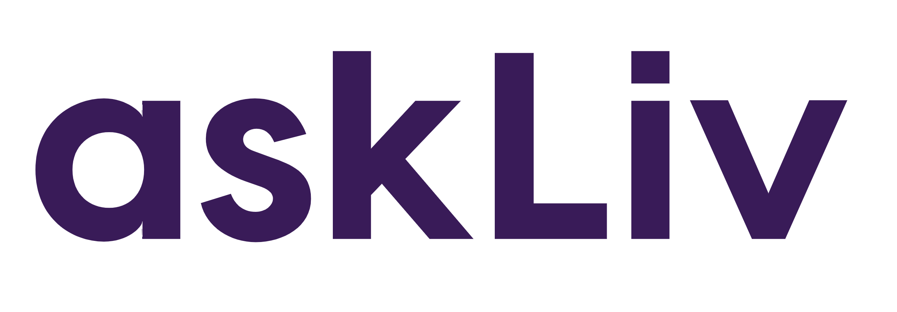

# GTH-Barcelona-AskLiv
Project submission for the `Global Travel Hackathon in Barcelona, by askliv team`.

**Allow people to be more confident when planning a trip.**



## :earth_americas: Website

askliv.app

## :computer: Repository

https://github.com/izebb/askliv

## :books: Description

Current online platforms are not catering to a large group of people which turn to offline vendors or do not travel at all because of missing accessibility. Our project, askLiv aggregates and makes travel advise actionable & relevant based on user specific needs. Solving real user problems and making travel more accessible by providing an easy to use content platform.

* Hackathon topic you used: 
  * Accessibility 
  * Community

* The development tools used to build the project: 
  * [Kiwi UI (orbit)](https://orbit.kiwi/), 
  * [React](https://reactjs.org/), 
  * [Firebase](https://firebase.google.com)
  
* SDKs used in the project;
  * [Contentful](https://www.contentful.com/)
  
* APIs used in the project;
  * [Contentful](https://www.contentful.com/)

* Any assets used in the project;
  * [Unsplash](https://unsplash.com/): For website images
  * [Noun Project](https://thenounproject.com): For icons
  
* Any libraries used in the project;
  * [React](https://reactjs.org/): To build the interface
  * [Moment](https://momentjs.com/): To handle the datepicker
  * [Orbit](https://orbit.kiwi/): UI library
  * [Contentful](https://www.contentful.com/): CMS to handle destinations, categories and questionaires
  
* Any components not created at the hackathon;
  * Authentication

## :hugs: Maintainers

List all the team members. For example:
* [Kevin James Parks - kevinjamesparks](https://github.com/kevinjamesparks)
* [Gabriel Izebhigie - izebb](https://github.com/izebb)
* [Djamal Sadaghiani - Djamal-Sadaghiani](https://github.com/Djamal-Sadaghiani)
* [Ana Schwendler - anaschwendler](https://github.com/anaschwendler)


## :tada: Why is this so awesome?

* Everyone knows someone that could benefit from a project that help show how to travel anywhere
* The main goal of the tool i to include all people that were maybe not able to travel before

## :hammer_and_wrench: Installation

1. Clone the project:

```console
$ git clone git@github.com:izebb/askliv.git
```

2. Run the installation:

```
$ npm install
```

3. Run the project locally:

```console
$ npm start
```

Then your project should be live at: [localhost:3000](localhost:3000)

## :bulb: Devstack

* For UX/UI we decided to use the Kiwi UI definitions

* For the app we used React

* For the database we used Firebase

## :warning: Licence

The code in this project is licensed under MIT license. By contributing to this project, you agree that your contributions will be licensed under its MIT license.
